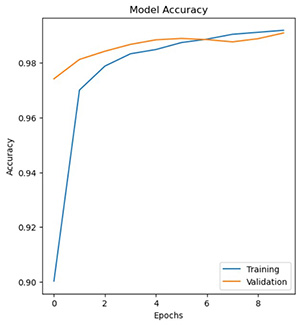
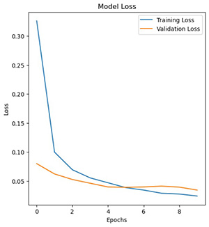

# MNIST Digit Recognition using Convolutional Neural Networks

This repository contains a deep learning model for recognizing handwritten digits from the MNIST dataset using TensorFlow and Keras.

## Overview

The MNIST dataset consists of 60,000 28x28 grayscale images of the ten digits, along with a test set of 10,000 images. The goal of this project is to develop a Convolutional Neural Network (CNN) that can accurately classify these handwritten digits.

## Features

- Utilizes TensorFlow and Keras to build and train the deep learning model.
- Preprocesses the dataset by normalizing the grayscale image data.
- Implements a CNN architecture with multiple convolutional and pooling layers.
- Uses Adam as the optimizer and categorical cross-entropy as the loss function.
- Provides a detailed model summary and training statistics.

## Getting Started

Follow these instructions to get the project up and running on your local machine for development and testing purposes.

### Prerequisites

- Python 3
- TensorFlow
- Keras
- Jupyter Notebook

### Model Training
The deep learning model is trained with the following configuration:

Number of Epochs: 10
Batch Size: 128
Optimizer: Adam
Validation Split: 20%
Number of Classes: 10

## Results

### Model Accuracy and Loss Graphs

The training process of our MNIST digit recognition model is illustrated by the following graphs, showing the model's accuracy and loss over epochs:

- The **Model Accuracy** graph demonstrates the accuracy of our model during the training phase (blue line) and the validation phase (orange line). As seen in the graph, the model achieves a high level of accuracy, quickly reaching and maintaining above 98%, which indicates a strong predictive performance.

  

- The **Model Loss** graph depicts the loss of our model during training (blue line) and validation (orange line). The training loss decreases rapidly in the initial epochs and then stabilizes, which is indicative of a well-fitting model that learns effectively from the training data without overfitting.

  

These graphs clearly show that our model has a robust learning curve, with the validation accuracy and loss closely following the training accuracy and loss, suggesting that the model generalizes well to new, unseen data.

### Test Set Results

Upon evaluation on the test set, our model has demonstrated excellent performance with a final loss of 0.0260 and an accuracy of 0.9915. These results underscore the model's capability to accurately recognize handwritten digits from the MNIST dataset.

